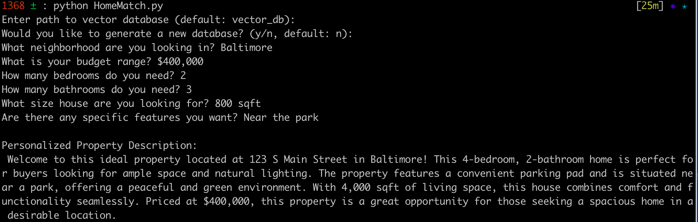
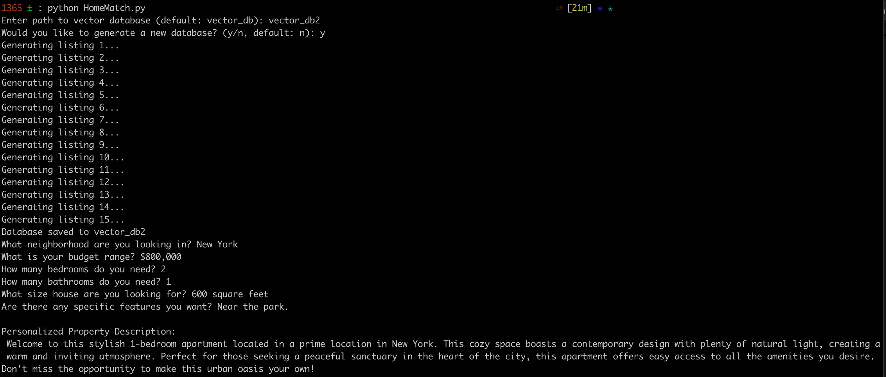
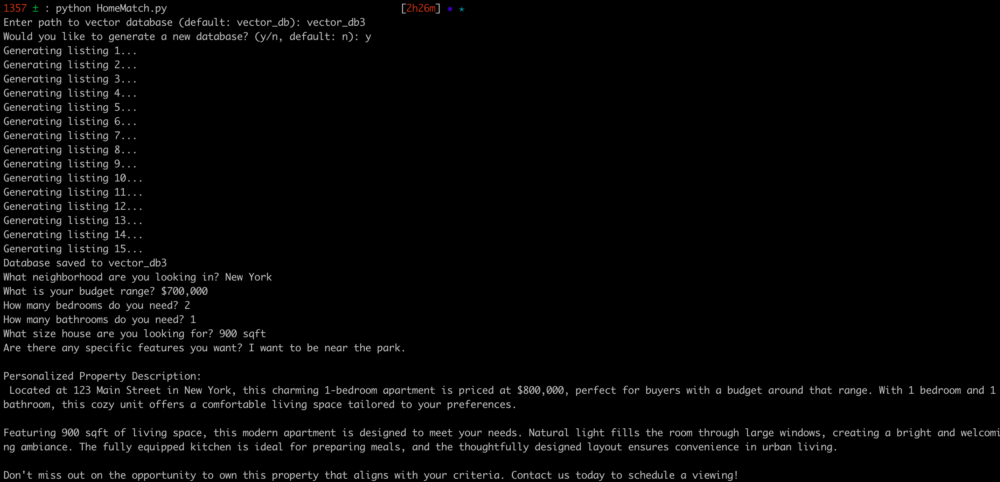

# Personalized Real Estate Agent
HomeMatch is a real estate matching system that leverages natural language processing (NLP) and vector databases to provide personalized home listings. The project utilizes OpenAI’s models alongside LangChain to process user preferences and match them with synthetic real estate listings. The system generates tailored home descriptions, ensuring that each recommendation aligns with the buyer’s specific needs.

The key concepts are shown in project.ipynd and a slightly more refined CLI application can be run using the HomeMatch.py file (see below for further instruction).

## Local Dev Installation Guide

This project uses **Conda** for environment management and **Makefile** commands for easy setup. Follow the steps below to get started.

### **1. Install Conda (if not already installed)**
If you don’t have Conda installed, download and install **[Miniconda](https://docs.conda.io/en/latest/miniconda.html)** or **[Anaconda](https://www.anaconda.com/products/distribution)**.

Check if Conda is installed:
```bash
conda --version
```

### **2. Create the Conda Environment**
Run the following command to create a new Conda environment with Python:
```bash
make create_env
```
This will create a Conda environment named **`my_env`** (or another name if modified in the Makefile) with Python installed.

### **3. Activate the Environment**
Once created, activate the Conda environment:
```bash
conda activate my_env
```

### **4. Install Rust (If not already installed)**
Some packages, like `tiktoken`, require Rust for installation. Run:
```bash
make install_rust
```
This will check if Rust is installed and install it if necessary.

### **5. Install Required Python Packages**
Now, install all dependencies listed in `requirements.txt`:
```bash
make install_reqs
```
This will:
- Ensure **`pip`**, `setuptools`, and `wheel` are up-to-date.
- Install all dependencies from `requirements.txt`.

### **6. Add env to Jupyter Notebook Kernal**
In order to use the enviroment we created with the make commands, while the env is active run
```bash
python -m ipykernel install --user --name=my_env --display-name "Python my_env" 
```
then when you start up the notebook choose the Python my_env for the Kernal


## Running CLI Application
With the proper environment activated with conda run 
```bash
python HomeMatch.py
```
This will start the program and will prompt you with serveral questions such as:
1) The path of your vector database.
2) If you would like to generate new synthetic listings
From there you will be prompted with questions about what home you're in the market to buy and the application will then query over the synthetic data and return a personalized description of the property to you.

## Example Outputs
### Example 1


### Example 2


### Example 3
